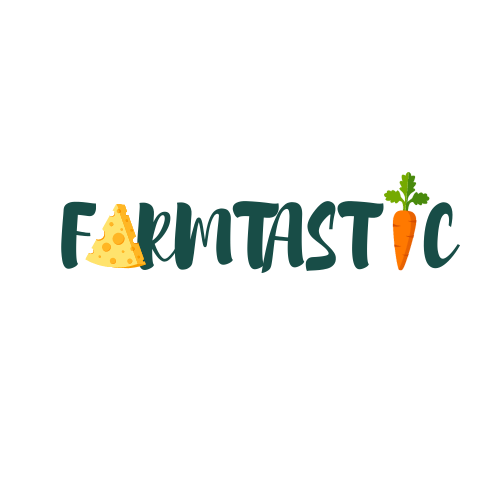

[![Swift Version][swift-image]][swift-url]

[![Build Status][travis-image]][travis-url]

[![License][license-image]][license-url]

[![Xcode][xcode-image]](https://developer.apple.com/documentation/xcode-release-notes/xcode-13_3_1-release-notes)


# Farmtastic Farmer

iOS Development group project at Metropolia UAS - Spring 2022

<br  />

<p  align="center">



</a>

<p  align="center">

### A solution for small farmers and organic food lovers

</p>

</p>

<p  align="row">


</p>

## Features

🍖 Farmer can browse, update, delete own product list

🥦 Active order list

📊 Monthly and yearly revenue and its composition

🥕 Select delivery location

🌽 In-app map and routing

## Requirements

- iOS 15.2+

- Xcode 13.3.1

## Installation

- Make sure you are using a Mac with Xcode updated to the newest version or 13.3.1+

- Clone the project

```zsh
git clone https://github.com/dieu-vu/farmtastic-farmer.git FarmtasticFarmerApp

```

- Open the project on Xcode

```zsh
cd FarmtasticFarmerApp
xed .
```

## Run project on Simulator

Press `Cmd+B` or [run from Xcode menu](https://developer.apple.com/documentation/xcode/running-your-app-in-the-simulator-or-on-a-device)

## Contributors

[Dieu Vu](https://github.com/dieu-vu)
[Giang Nguyen](https://github.com/GiangNguyen1207)
[Hang Huynh](https://github.com/HangHuynh19)
[Trang Nguyen](https://github.com/maitrang85)

[swift-image]: https://img.shields.io/badge/swift-5.0-orange.svg
[xcode-image]: https://img.shields.io/badge/xcode-13.3.1-green.svg
[swift-url]: https://swift.org/
[license-image]: https://img.shields.io/badge/License-MIT-blue.svg
[license-url]: LICENSE
