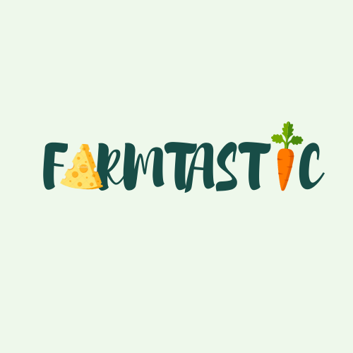

[![Swift Version][swift-image]][swift-url]
[![License][license-image]][license-url]
[![Xcode][xcode-image]](https://developer.apple.com/documentation/xcode-release-notes/xcode-13_3_1-release-notes)


# Farmtastic Farmer

iOS Development group project at Metropolia UAS - Spring 2022

<br  />

<p  align="center">



</a>

<p  align="center">

### A solution for small farmers and organic food lovers

</p>

</p>

<p  align="row">


</p>

<p>

### Demo recording with full features

<p>

 [
  ](https://youtu.be/fS2B3cMipnM)
  
</p>

## Features

🍖 Farmer can browse, update, delete own product list

🥦 Active order list

📊 Monthly and yearly revenue and its composition

🥕 Select delivery location

🌽 In-app map and routing

📢 Speech-to-text search

**NOTES**: The register function is not available. Please contact the contributor if you want to have a test user account.

### Functional requirements implemented:

- [x] Application supports multiple languages through localization.
- [x] Application persists data on the device using the Core Data framework.
- [x] Application uses MapKit
- [x] Application retrieves data from network in JSON/XML format
- [x] Application uses speech recognition, for example for dictation
- [x] Application has master / detail views
- [x] Basic Unit tests and UI unit tests

## Requirements

- iOS 15.2+

- Xcode 13.3.1

## Installation

- Make sure you are using a Mac with Xcode updated to the newest version or 13.3.1+

- Clone the project

```zsh
git clone https://github.com/dieu-vu/farmtastic-farmer.git FarmtasticFarmerApp

```

- Open the project on Xcode

```zsh
cd FarmtasticFarmerApp
xed .
```

## Run project on Simulator

Press `Cmd+B` or [run from Xcode menu](https://developer.apple.com/documentation/xcode/running-your-app-in-the-simulator-or-on-a-device)

## Resources

- [Metropolia's WBMA API doc](https://media.mw.metropolia.fi/wbma/docs/)
- [Wireframe](https://www.figma.com/file/lCpZyRcrzvuiIQ6xbi6LKS/Farmtastic?node-id=0%3A1)
- [Kanban board](https://miro.com/app/board/uXjVODnLEX8=/?share_link_id=523297843888)
- [Google Drive](https://drive.google.com/drive/folders/1a3XQqAnz3He3FRIf2Q2VWADE-m5gd8-_?usp=sharing): paper prototypes, storyboards, user interviews findings, sprint meeting notes, etc.

## Used Packages
- [Charts](https://github.com/danielgindi/Charts): Used to display charts on statistics screen
- [AlertToast](https://github.com/elai950/AlertToast): Used to display toast in the app

In case of dependencies issue: Navigate to top menu in Xcode: `File > Packages > Reset Package caches` and rebuild the project

## Contributors

[Dieu Vu](https://github.com/dieu-vu)

[Giang Nguyen](https://github.com/GiangNguyen1207)

[Hang Huynh](https://github.com/HangHuynh19)

[Trang Nguyen](https://github.com/maitrang85)

With the guidance and support from teachers at Metropolia UAS: Peter Hjort, Juha Forsten, and Ulla Sederlöf.

Questions and comments are welcomed.

[swift-image]: https://img.shields.io/badge/swift-5.6-orange.svg
[xcode-image]: https://img.shields.io/badge/xcode-13.3.1-green.svg
[swift-url]: https://swift.org/
[license-image]: https://img.shields.io/badge/License-MIT-blue.svg
[license-url]: LICENSE
